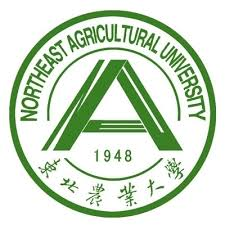

<h1> 刘泽宇 </h1>

- **电话**: 181 0460 2203
- **邮箱**: LZY19970404@163.com
- **QQ**: 1234567
- **微信**: 1234567

---

## 个人简介

- **姓名**: 刘泽宇
- **性别**: 女
- **学历**: 本科（2020级毕业生）
- **GitHub**: **[https://github.com/liuzeyu0404](https://github.com/liuzeyu0404)**
- **工作方向**: 人事、财务、行政
- **入职时间**: 随时
- **目标薪资**: 6k ~ 12k
- **意向城市**: 南京、苏州、杭州、宁波等长三角城市
- **特别声明**: 本简历中含多个链接，欢迎点击浏览

---

## 教育背景

- **学校**: **[东北农业大学](http://www.neau.edu.cn/)**（2016～2020）

- **专业**: 金融学 / 经济管理学院

- **GPA**: 4.0+ / 5.0

- **专业课成绩**:

| 宏微观经济学 | 投资学 | 项目投资评估 | 银行会计学 | 管理学 | 市场营销学 | 公司金融 |
| :---: | :---: | :---: | :---: | :---: | :---: | :---: |
| 85/100 | 87/100 | 90/100 | 80/100 | 优秀 | 优秀 | 94/100 |

---

## 个人经历

### 实习经历

- 「2017~2018」 在 **东北农业大学秘书处** 工作，并担任 **办公室助理** 一职
    - 整理学校公文，进行文件档案资料的建立、健全和归档整理，并及时更新、维护、备份和管理，做好上传下达、内外联络沟通工作
    - 协助管理老师处理部门日常事务，并在办公室老师领导下做好办公室日常行政事务及文秘工作

- 「2018~2019」 曾于 **[江海证券有限公司](https://www.jhzq.com.cn/)** **营业部** 实习
    - 负责资料的征订整理，以及各种函件的上传下送
    - 负责领导日常行程及会务安排
    - 负责公司会议室和办公场所的管理
    - 处理公司与相关机构的日常联络工作

- 「2019~2020」 曾于 **[华夏银行哈尔滨分行](http://www.hxb.com.cn/index.shtml)** **贷款部** 实习
    - 沟通客户，了解客户在财务方面存在的问题以及理财方面的需求
    - 结合客户提供的第三方询证、信用报告及公民身份信息等材料信息，了解评估并核实确认客户的贷款偿还能力
    - 协助客户提交各项贷款业务申请材料，进行前期核实工作，确认其真实性，并及时有效的和银行客户经理沟通，协助完成客户签约
    - 对相关客户资料、合同协议等进行记录、整理、归档，定期进行客户关怀，增强客户粘性
    - 跟进意向客户，定期回访、维护已有客户，提高客户满意度

### 校园经历

- 「2016～2018」 在 **学院青年传媒中心** 工作，并担任 **记者站副部长** 一职
    - 曾多次承接校级、院级会议、各类晚会的拍摄工作，掌握人像、风景、会议等各类应用途径的拍摄技巧
    - 熟练运用Photoshop、Premiere，曾独立完成 **[个人作品]()**，浏览量达8.7万，播放量1.5万
    - 独立策划院级摄影比赛并撰写策划案，参赛者50人以上

- 「2018～2019」 参与 **黑龙江省俄罗斯民俗文化研究** 比赛，并获 **院级三等奖**
    - 制定实地调研计划，并根据实际需要进行人员分工和角色定位
    - 负责相关数据的记录、整理、归类和和分析，为调研报告的撰写提供客观有效的数据支持
    - 梳理调研流程，根据实际调研经历和客观数据材料形成调研成果，并制作汇报PPT

### 技能证书

- 「2017～2018」 **[国家计算机二级证书]()**
- 「2017～2018」 **[证券从业资格证书]()**
- 「2018～2019」 **[英语六级证书]()**

---

## 个人技能

- **办公软件**
    - 频繁使用Office系列、WPS系列等软件办公

- **多媒体编辑**
    - 熟练使用PS、PR等多媒体编辑工具，曾独立制作企业宣传视频、海报

- **公众号运营**
    - 具有维持公众号运营与撰写文案的能力，文学功底扎实

- **语言方面**
    - 英语6级516分，考研期间对英语知识再次系统性的梳理，收获颇多

---

## 备注

> HR，您好
我个人对人事行政类工作感兴趣，比如人力资源管理、财务管理、文秘等。  
首先，我性格开朗，比较健谈，喜欢与人交流，帮助别人让我觉得很愉快。
其次，我在实习中多次参与管理方面的工作，积累了大量的相关经验。
细心和耐心是我的长处，我觉得我比较能胜任此类工作 QvQ
希望我们有一个好的匹配度。  
See you
